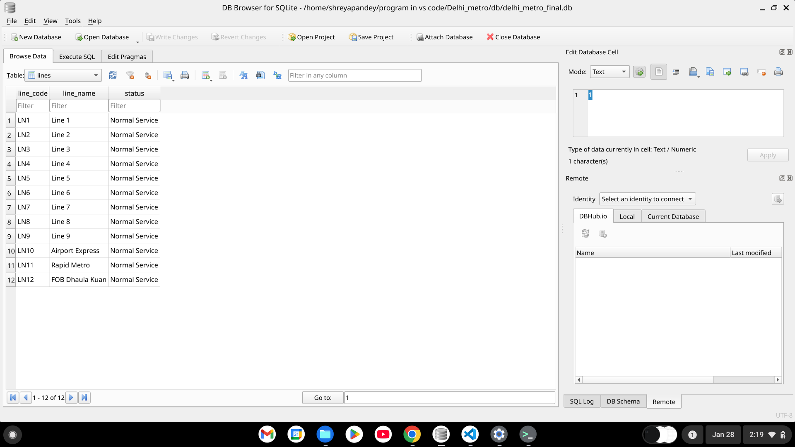
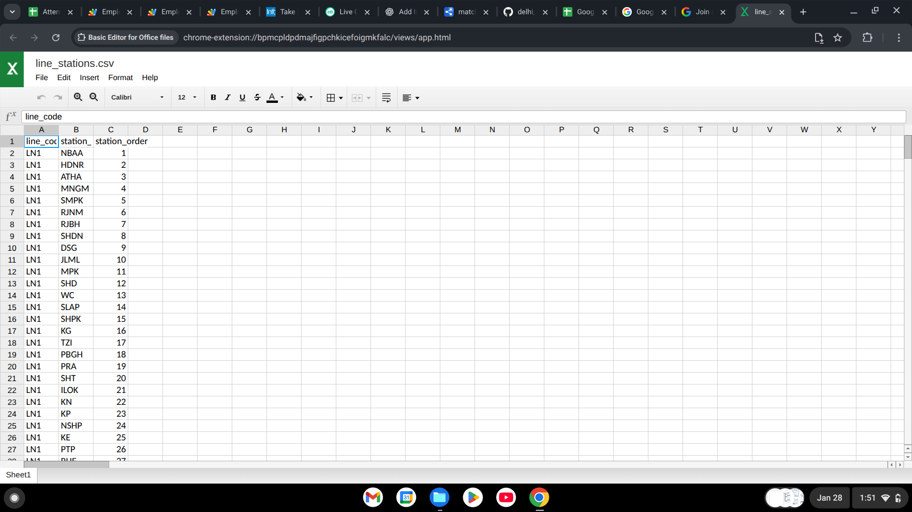
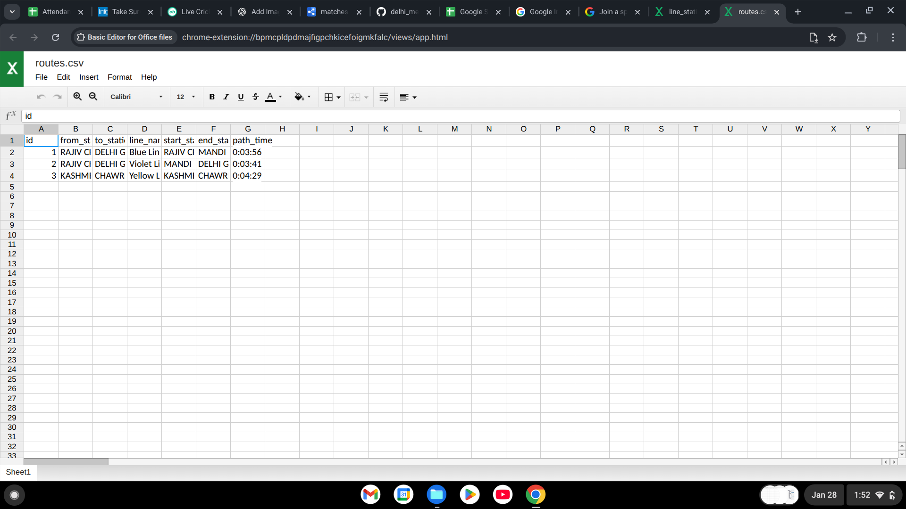
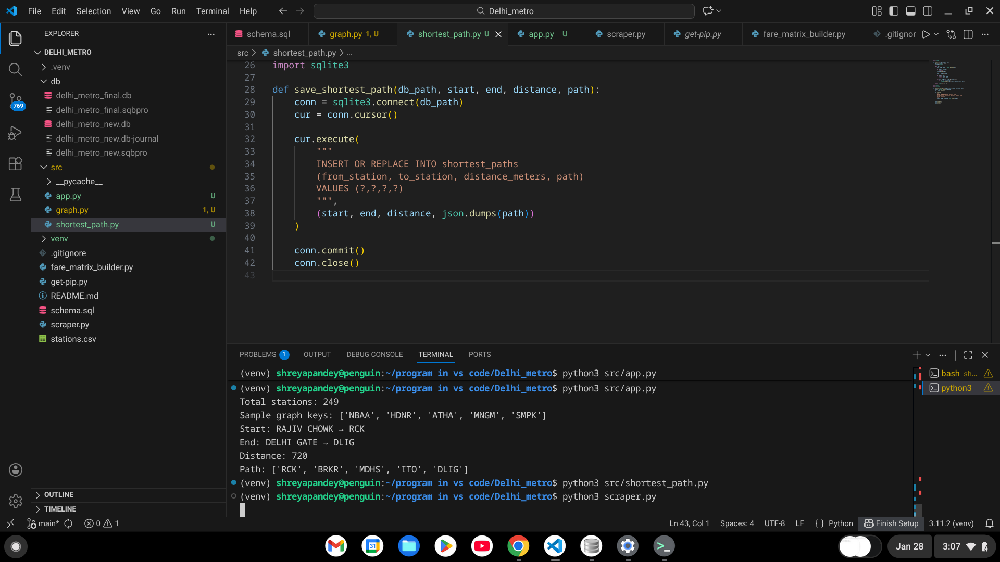
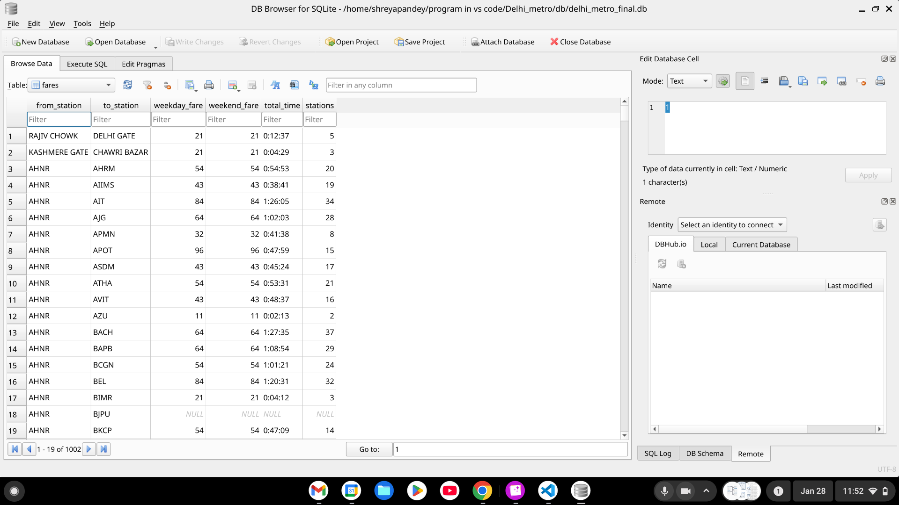
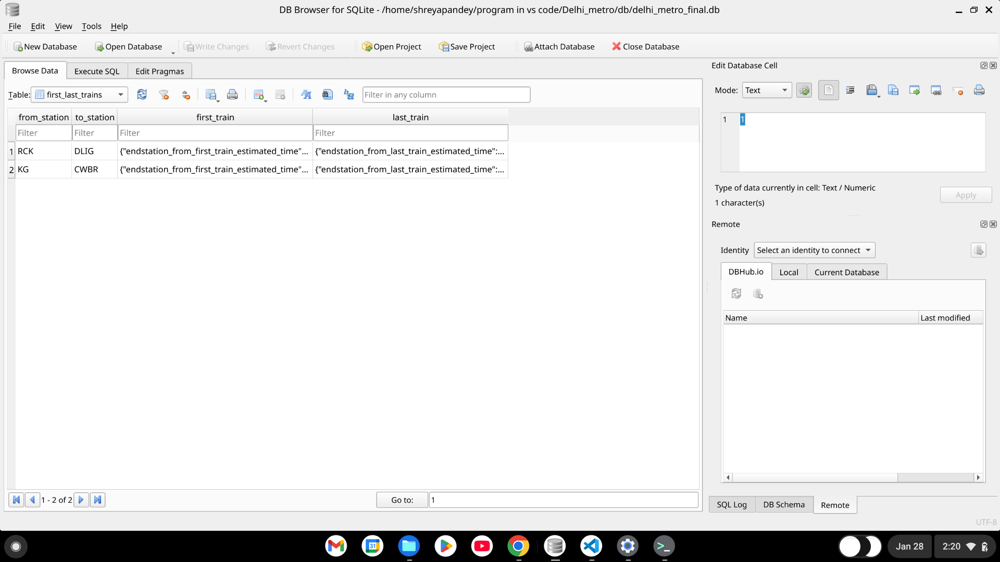

# 🚇 Delhi Metro Line ETL & Routing Pipeline

## 📌 Project Overview

This project implements a **data engineering pipeline** for Delhi Metro data that:

- Extracts station and route information dynamically using DMRC backend APIs  
- Normalizes and stores the data
- Enables calculation of the **shortest route** between any two metro stations  
- Handles structured storage in SQLite and visual reference via CSV

This is designed as a **realistic ETL + graph traversal assignment** demonstrating API extraction, clean data modeling, and algorithmic routing.

---

## 🧱 Pipeline Architecture

Delhi Metro Backend APIs
↓
[Extract]
• Line list
• Station details
• Routes between station pairs
↓
[Transform]
• Normalize nested API data
• Build adjacency and graph structure
• Convert strings to usable formats (times, codes)
↓
[Load / Use]
• SQLite database for storage
• Shortest path algorithms in Python
• CSV export (optional)

yaml
Copy code

---

## 🌐 APIs Used

### 1. Line List
Fetches available metro lines:

GET https://backend.delhimetrorail.com/api/v2/en/line_list?format=json

pgsql
Copy code

### 2. Stations by Line
Lists stations for each line:

GET https://backend.delhimetrorail.com/api/v2/en/station_by_line/{code}

shell
Copy code

### 3. Fare with Route
Fetches fare and route details between two stations:

GET https://backend.delhimetrorail.com/api/v2/en/new_fare_with_route/{f}/{t}/least-distance/

sql
Copy code

### 4. First and Last Train
Fetches first/last train timings between stations:

GET https://backend.delhimetrorail.com/api/v2/en/first_and_last_train_with_filter/{f}/{t}/least-distance/

yaml
Copy code

---

## 📂 Repository Structure

delhi_metro_line/
│
├── db/ # SQLite database output
├── images/ # Screenshots used in this README
├── src/ # Python source code
│ ├── graph.py # Builds graph from DB for routing
│ ├── shortest_path.py # Dijkstra implementation
│ └── app.py # Routing entry point
|
├── scraper.py # ETL to fetch DMRC data into SQLite
├── pipeline.py # (Optional) orchestrates scraper + routing
├── README.md # This documentation
├── .gitignore
└── requirements.txt # Python dependencies

yaml
Copy code

---

## 🛠️ Tech Stack

| Component | Technology |
|-----------|------------|
| Language  | Python 3.x |
| HTTP      | `requests` |
| Data      | SQLite |
| Graph     | Dijkstra algorithm |
| CSV/Export| Optional (Python) |

---

## 📌 Database Schema

The SQLite database includes the following tables:

### **lines**
Columns:
- `line_code` TEXT (PK)
- `line_name` TEXT
- `status` TEXT

### **stations**
Columns:
- `station_code` TEXT (PK)
- `station_name` TEXT

### **line_stations**
Columns:
- `line_code` TEXT
- `station_code` TEXT
- `station_order` INTEGER
Primary key: (line_code, station_code)

### **routes**
Columns:
- `from_station` TEXT
- `to_station` TEXT
- `line_code` TEXT
- `travel_time` INTEGER
- `line_name` TEXT

### **fares**
Columns:
- `from_station` TEXT
- `to_station` TEXT
- `weekday_fare` INTEGER
- `weekend_fare` INTEGER
- `total_time` TEXT
- `stations` INTEGER

### **first_last_trains**
Columns:
- `from_station` TEXT
- `to_station` TEXT
- `first_train` TEXT
- `last_train` TEXT

---

## 📸 Visual Reference

### Lines Data


---

### Line–Station Mapping


---

### Route Overview


---

### Shortest Path Output


---

### Fare Calculation Data


---

### First & Last Train


---

## ⚙️ Getting Started (How to Run)

### 1️⃣ Clone the Repository

```bash
git clone https://github.com/shreyapandey-ai/delhi_metro_line.git
cd delhi_metro_line
2️⃣ Create and Activate Virtual Environment
bash
Copy code
python3 -m venv venv
source venv/bin/activate       # Linux / macOS
venv\Scripts\activate          # Windows
3️⃣ Install Dependencies
bash
Copy code
pip install -r requirements.txt
If you don’t have a requirements.txt, install manually:

bash
Copy code
pip install requests
4️⃣ Populate the Database (ETL)
bash
Copy code
python3 scraper.py
This will:

Fetch lines

Fetch stations by line

Insert into SQLite database

Optionally fetch fare & first/last train data for sample pairs

5️⃣ Compute Shortest Paths
Run the routing script:

bash
Copy code
python3 src/app.py
You can change origin/destination inside the script.

Example default output:

less
Copy code
Total stations: 249
Distance: 720
Path: ['RCK', 'BRKR', 'MDHS', 'ITO', 'DLIG']
🧪 Using the Routing Output
This script uses Dijkstra’s algorithm to compute the shortest path based on travel_time or distance-like weights derived from your routes.

Input: two station codes

Output: list of station codes representing the shortest path

If you want to use station names, convert names → codes using the stations table first.

🧠 Design Choices
Graph built from SQLite route data

Route weight = travel time in seconds

Bidirectional edges included

Simple Python implementation avoids external graph libraries

📌 Notes
DMRC API endpoints used here are not officially documented — they may change

Data availability and complete coverage may vary

Only demo/fallback data included in some tables

👤 Author
Shreya Pandey
GitHub: https://github.com/shreyapandey-ai
